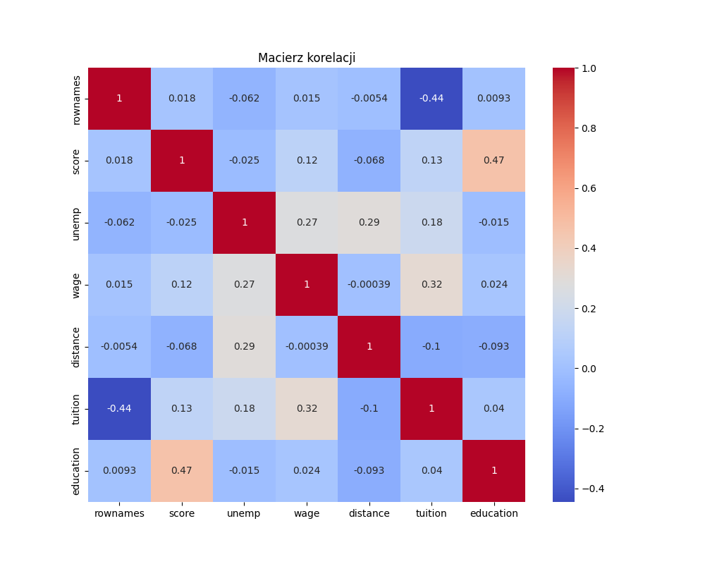
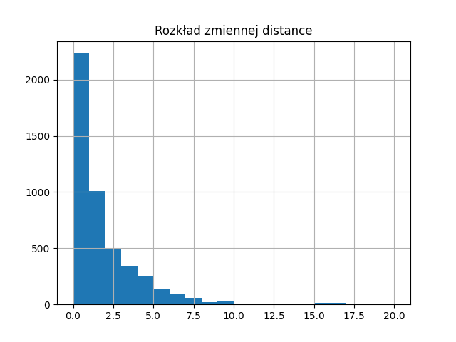
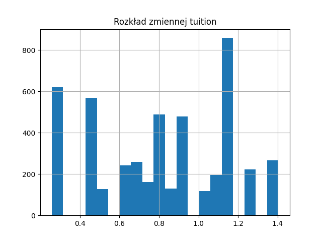
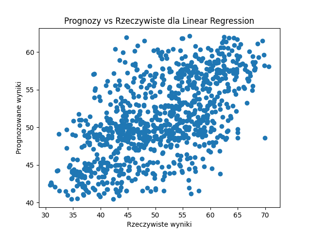
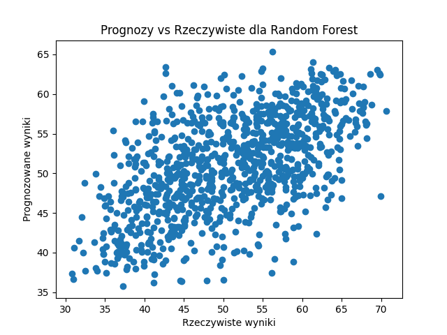
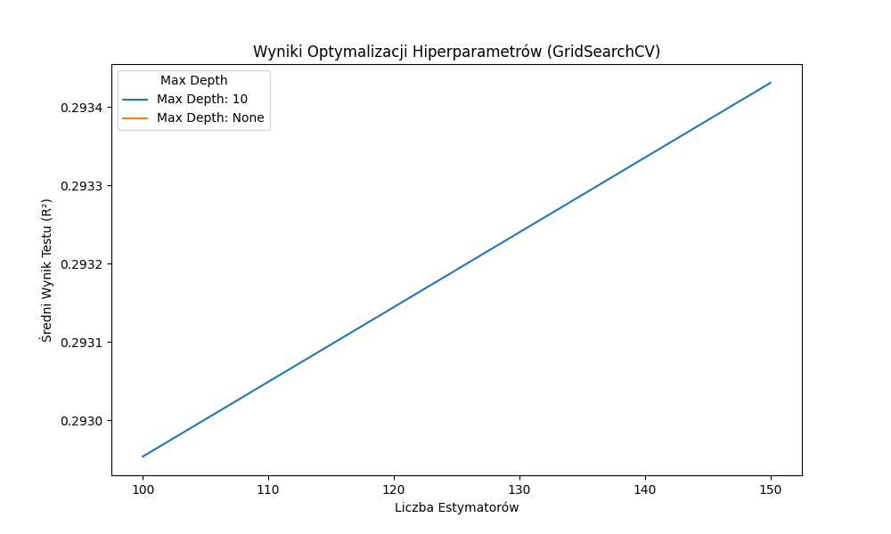

# Raport z analizy danych i budowy modelu predykcyjnego

## 1. Cel projektu
Celem projektu jest zbudowanie modelu predykcyjnego, który przewiduje wartość zmiennej `score` na podstawie dostarczonego zestawu danych. Proces ten obejmuje:
- Eksplorację i wstępną analizę danych,
- Inżynierię cech i przygotowanie danych,
- Wybór i trenowanie modelu,
- Ewaluację oraz optymalizację modelu.

## 2. Eksploracja i wstępna analiza danych

### 2.1. Wczytanie i zapoznanie się z danymi
Dane wczytano z pliku `CollegeDistance.csv`. Na podstawie wstępnych statystyk opisowych dla zmiennych numerycznych zidentyfikowano ich rozkład oraz kluczowe właściwości.

### 2.2. Brakujące wartości
Nie wykryto brakujących wartości, co umożliwiło bezpośrednie przejście do dalszych etapów analizy.

### 2.3. Analiza korelacji
Aby zidentyfikować zależności między zmiennymi numerycznymi, obliczono macierz korelacji. W wyniku analizy zauważono, że niektóre zmienne wykazują istotną korelację, co jest pomocne przy wyborze cech modelu.

*Rysunek 1. Macierz korelacji dla zmiennych numerycznych. Obszary z intensywniejszym kolorem wskazują na wyższą korelację pomiędzy zmiennymi, co sugeruje ich powiązania.*

## 3. Inżynieria cech i przygotowanie danych

### 3.1. Przetwarzanie zmiennych kategorycznych i numerycznych
Zmienne kategoryczne zakodowano za pomocą `OneHotEncoder`, natomiast zmienne numeryczne standaryzowano przy użyciu `StandardScaler`, aby zminimalizować wpływ różnych skal.

### 3.2. Podział danych
Dane podzielono na zbiór treningowy (80%) i testowy (20%), co zapewniło warunki do oceny skuteczności modeli na nieznanych danych.

### 3.3. Rozkłady zmiennych numerycznych
Aby lepiej zrozumieć charakterystykę danych, dla każdej zmiennej numerycznej wygenerowano histogramy rozkładu:

*Rysunek 2. Histogram przedstawiający rozkład zmiennej `tuition`. Pokazuje, czy rozkład jest symetryczny lub czy posiada ekstremalne wartości.*

*Rysunek 3. Histogram przedstawiający rozkład zmiennej `education`.*

(...)

Kontynuacja dla pozostałych zmiennych numerycznych.

## 4. Wybór i trenowanie modeli

### 4.1. Wybrane modele
Wybrano dwa modele o różnych charakterystykach:
- **Regresję liniową** – dla oceny liniowych zależności.
- **Las losowy** – dla uchwycenia bardziej złożonych zależności.

### 4.2. Trenowanie modeli i ocena wyników
Dla każdego modelu wygenerowano wykresy porównujące wartości rzeczywiste zmiennej `score` z wartościami przewidywanymi:

#### Model: Regresja liniowa

*Rysunek 4. Prognozy vs Rzeczywiste wartości dla modelu regresji liniowej. Wykres pokazuje, jak dobrze wartości prognozowane pasują do rzeczywistych.*

#### Model: Las losowy

*Rysunek 5. Prognozy vs Rzeczywiste wartości dla modelu lasu losowego. Lepsze dopasowanie wskazuje na bardziej precyzyjne przewidywania.*

## 5. Ewaluacja i optymalizacja modelu

### 5.1. Metryki oceny
Modele oceniono za pomocą:
- **MSE (Mean Squared Error)** – niższa wartość wskazuje na lepsze dopasowanie modelu.
- **R² (R-squared)** – wyższa wartość oznacza, że model lepiej wyjaśnia zmienność danych.

Wyniki zapisano w plikach `evaluation_Linear_Regression.txt` i `evaluation_Random_Forest.txt`.

### 5.2. Optymalizacja hiperparametrów
Optymalizację modelu lasu losowego przeprowadzono za pomocą `GridSearchCV`. Wyniki najlepszego modelu zapisano w `evaluation_best_model.txt`.

*Rysunek 6. Wyniki optymalizacji hiperparametrów dla modelu lasu losowego. Wykres pokazuje wpływ liczby estymatorów oraz maksymalnej głębokości drzewa na wynik testu (R²). Wyższe wartości R² wskazują na lepszą skuteczność modelu przy danej kombinacji parametrów.*

## 6. Wnioski końcowe
W wyniku analizy oraz optymalizacji stwierdzono, że model lasu losowego, po zastosowaniu odpowiednich hiperparametrów, przewyższa regresję liniową w przewidywaniu wartości `score`. Dalsze kroki mogą obejmować bardziej zaawansowane algorytmy oraz dodatkową inżynierię cech.
